Hotel Booking Demand Anlysis
================
Hongyu Wang (Olivia)
12/22/2020

### PART1 Introduction

In my project, I am working with hotel booking demand available on
Kaggle, which contains booking information for a city hotel and a resort
hotel, and includes information such as when the booking was made,
arrival date, length of stay, the number of adults, children, and/or
babies, and the number of available parking spaces, among other things.

The varibales and the description of the values that I included from the
original data are as follows:

1.  hotel: Hotel (H1 = Resort Hotel or H2 = City Hotel)
2.  is\_canceled: Value indicating if the booking was canceled (1) or
    not (0)
3.  lead\_time: Number of days that elapsed between the entering date of
    the booking into the PMS and the arrival date
4.  arrival\_date\_year: Year of arrival date
5.  arrival\_date\_month: Month of arrival date
6.  arrival\_date\_day\_of\_month: Day of arrival date
7.  stays\_in\_weekend\_nights: Number of weekend nights (Saturday or
    Sunday) the guest stayed or booked to stay at the hotel
8.  stays\_in\_week\_nights: Number of week nights (Monday to Friday)
    the guest stayed or booked to stay at the hotel
9.  adults: Number of adults
10. children: Number of children
11. babies: Number of babies
12. mealType of meal booked. Categories are presented in standard
    hospitality meal packages: Undefined/SC – no meal package; BB – Bed
    & Breakfast; HB – Half board (breakfast and one other meal – usually
    dinner); FB – Full board (breakfast, lunch and dinner)
13. country: Country of origin. Categories are represented in the ISO
    3155–3:2013 format
14. distribution\_channel: Booking distribution channel. The term “TA”
    means “Travel Agents” and “TO” means “Tour Operators”
15. is\_repeated\_guestValue indicating if the booking name was from a
    repeated guest (1) or not (0)
16. previous\_cancellations: Number of previous bookings that were
    cancelled by the customer prior to the current booking
17. previous\_bookings\_not\_canceled: Number of previous bookings not
    cancelled by the customer prior to the current booking
18. reserved\_room\_type: Code of room type reserved. Code is presented
    instead of designation for anonymity reasons.
19. required\_car\_parking\_spaces: Number of car parking spaces
    required by the customer

### PART2 Preparing the data

  - Load required packages and import data

<!-- end list -->

``` r
# Set up R markdown
knitr::opts_chunk$set(echo = TRUE, fig.align='center', warning = FALSE, 
                      message = FALSE)
# Load in required packages
suppressMessages(library(dplyr))
suppressMessages(library(tidyr))
suppressMessages(library(ggplot2))
suppressMessages(library(tidyverse))
suppressMessages(library(lubridate))
suppressMessages(library(GGally))
suppressMessages(library(gridExtra))
suppressMessages(library(sampling))
# read dataset
df <- read.csv("/Users/hongyuwang/Documents/R_project/Hotel_booking/hotel_bookings.csv")
```

  - structure of the dataframe

<!-- end list -->

``` r
str(df)
```

    ## 'data.frame':    119390 obs. of  32 variables:
    ##  $ hotel                         : chr  "Resort Hotel" "Resort Hotel" "Resort Hotel" "Resort Hotel" ...
    ##  $ is_canceled                   : int  0 0 0 0 0 0 0 0 1 1 ...
    ##  $ lead_time                     : int  342 737 7 13 14 14 0 9 85 75 ...
    ##  $ arrival_date_year             : int  2015 2015 2015 2015 2015 2015 2015 2015 2015 2015 ...
    ##  $ arrival_date_month            : chr  "July" "July" "July" "July" ...
    ##  $ arrival_date_week_number      : int  27 27 27 27 27 27 27 27 27 27 ...
    ##  $ arrival_date_day_of_month     : int  1 1 1 1 1 1 1 1 1 1 ...
    ##  $ stays_in_weekend_nights       : int  0 0 0 0 0 0 0 0 0 0 ...
    ##  $ stays_in_week_nights          : int  0 0 1 1 2 2 2 2 3 3 ...
    ##  $ adults                        : int  2 2 1 1 2 2 2 2 2 2 ...
    ##  $ children                      : int  0 0 0 0 0 0 0 0 0 0 ...
    ##  $ babies                        : int  0 0 0 0 0 0 0 0 0 0 ...
    ##  $ meal                          : chr  "BB" "BB" "BB" "BB" ...
    ##  $ country                       : chr  "PRT" "PRT" "GBR" "GBR" ...
    ##  $ market_segment                : chr  "Direct" "Direct" "Direct" "Corporate" ...
    ##  $ distribution_channel          : chr  "Direct" "Direct" "Direct" "Corporate" ...
    ##  $ is_repeated_guest             : int  0 0 0 0 0 0 0 0 0 0 ...
    ##  $ previous_cancellations        : int  0 0 0 0 0 0 0 0 0 0 ...
    ##  $ previous_bookings_not_canceled: int  0 0 0 0 0 0 0 0 0 0 ...
    ##  $ reserved_room_type            : chr  "C" "C" "A" "A" ...
    ##  $ assigned_room_type            : chr  "C" "C" "C" "A" ...
    ##  $ booking_changes               : int  3 4 0 0 0 0 0 0 0 0 ...
    ##  $ deposit_type                  : chr  "No Deposit" "No Deposit" "No Deposit" "No Deposit" ...
    ##  $ agent                         : chr  "NULL" "NULL" "NULL" "304" ...
    ##  $ company                       : chr  "NULL" "NULL" "NULL" "NULL" ...
    ##  $ days_in_waiting_list          : int  0 0 0 0 0 0 0 0 0 0 ...
    ##  $ customer_type                 : chr  "Transient" "Transient" "Transient" "Transient" ...
    ##  $ adr                           : num  0 0 75 75 98 ...
    ##  $ required_car_parking_spaces   : int  0 0 0 0 0 0 0 0 0 0 ...
    ##  $ total_of_special_requests     : int  0 0 0 0 1 1 0 1 1 0 ...
    ##  $ reservation_status            : chr  "Check-Out" "Check-Out" "Check-Out" "Check-Out" ...
    ##  $ reservation_status_date       : chr  "2015-07-01" "2015-07-01" "2015-07-02" "2015-07-02" ...

From the structure of the dataframe, I think combining
arrival\_date\_year, arrival\_date\_month and
arrival\_date\_day\_of\_month these three columns into one single coulmn
- arrival\_date would be necessary for my analysis.

``` r
df$arrival_date_month <- ordered(df$arrival_date_month, 
                                 levels = c("January", "February", "March", "April", "May",
                                            "June", "July", "August", "September", "October",
                                            "November", "December"))
df <- df %>% mutate(arrival_date = make_date(arrival_date_year, 
                                             arrival_date_month,  
                                             arrival_date_day_of_month))
head(df$arrival_date)
```

    ## [1] "2015-07-01" "2015-07-01" "2015-07-01" "2015-07-01" "2015-07-01"
    ## [6] "2015-07-01"

  - Dealing with NAs

<!-- end list -->

``` r
# extract columns that we need
df <- df[c("hotel", "is_canceled", "lead_time", "arrival_date", 
                                   "arrival_date_month", "arrival_date_year",
                                   "stays_in_weekend_nights", "stays_in_week_nights",
                                   "adults", "children", "babies", "meal", "country",
                                   "distribution_channel", "is_repeated_guest",
                                   "previous_cancellations",
                                   "previous_bookings_not_canceled", "reserved_room_type",
                                   "required_car_parking_spaces")]
# check whether the data contains any NAs
any(is.na(df))
```

    ## [1] TRUE

The result shows that there are any NAs in our data frame and therefore
we need to get rid of them. Also, I only keep the columns that we are
interested in.

``` r
# remove rows containing NAs
hotel_bookings <- df[complete.cases(df),]
any(is.na(hotel_bookings))
```

the output - FALSE indicates that we’ve removed NAs successfully.

  - summary of dataframe

<!-- end list -->

``` r
# Look at the summary of statistics for the dataframe
summary(hotel_bookings)
```

    ##     hotel            is_canceled       lead_time    arrival_date       
    ##  Length:119386      Min.   :0.0000   Min.   :  0   Min.   :2015-07-01  
    ##  Class :character   1st Qu.:0.0000   1st Qu.: 18   1st Qu.:2016-03-13  
    ##  Mode  :character   Median :0.0000   Median : 69   Median :2016-09-06  
    ##                     Mean   :0.3704   Mean   :104   Mean   :2016-08-28  
    ##                     3rd Qu.:1.0000   3rd Qu.:160   3rd Qu.:2017-03-18  
    ##                     Max.   :1.0000   Max.   :737   Max.   :2017-08-31  
    ##                                                                        
    ##  arrival_date_month arrival_date_year stays_in_weekend_nights
    ##  August :13873      Min.   :2015      Min.   : 0.0000        
    ##  July   :12661      1st Qu.:2016      1st Qu.: 0.0000        
    ##  May    :11791      Median :2016      Median : 1.0000        
    ##  October:11160      Mean   :2016      Mean   : 0.9276        
    ##  April  :11089      3rd Qu.:2017      3rd Qu.: 2.0000        
    ##  June   :10939      Max.   :2017      Max.   :19.0000        
    ##  (Other):47873                                               
    ##  stays_in_week_nights     adults          children           babies         
    ##  Min.   : 0.0         Min.   : 0.000   Min.   : 0.0000   Min.   : 0.000000  
    ##  1st Qu.: 1.0         1st Qu.: 2.000   1st Qu.: 0.0000   1st Qu.: 0.000000  
    ##  Median : 2.0         Median : 2.000   Median : 0.0000   Median : 0.000000  
    ##  Mean   : 2.5         Mean   : 1.856   Mean   : 0.1039   Mean   : 0.007949  
    ##  3rd Qu.: 3.0         3rd Qu.: 2.000   3rd Qu.: 0.0000   3rd Qu.: 0.000000  
    ##  Max.   :50.0         Max.   :55.000   Max.   :10.0000   Max.   :10.000000  
    ##                                                                             
    ##      meal             country          distribution_channel is_repeated_guest
    ##  Length:119386      Length:119386      Length:119386        Min.   :0.00000  
    ##  Class :character   Class :character   Class :character     1st Qu.:0.00000  
    ##  Mode  :character   Mode  :character   Mode  :character     Median :0.00000  
    ##                                                             Mean   :0.03191  
    ##                                                             3rd Qu.:0.00000  
    ##                                                             Max.   :1.00000  
    ##                                                                              
    ##  previous_cancellations previous_bookings_not_canceled reserved_room_type
    ##  Min.   : 0.00000       Min.   : 0.0000                Length:119386     
    ##  1st Qu.: 0.00000       1st Qu.: 0.0000                Class :character  
    ##  Median : 0.00000       Median : 0.0000                Mode  :character  
    ##  Mean   : 0.08712       Mean   : 0.1371                                  
    ##  3rd Qu.: 0.00000       3rd Qu.: 0.0000                                  
    ##  Max.   :26.00000       Max.   :72.0000                                  
    ##                                                                          
    ##  required_car_parking_spaces
    ##  Min.   :0.00000            
    ##  1st Qu.:0.00000            
    ##  Median :0.00000            
    ##  Mean   :0.06252            
    ##  3rd Qu.:0.00000            
    ##  Max.   :8.00000            
    ## 

From the summay of hotel\_bookings. we can see that there is no obvious
data error such as negative data.  
This data summary reveals some useful information:  
1\. 37.04% of booking are cancled according to the mean value for the
is\_canceld column.  
2\. People who booking the hotel are mostly adults and very small amount
of children and babies.  
3\. The most populat type of meal is Bed & Breakfast, while the least
popular one is Full Board(breakfast, lunch and dinner). Among all the
type of meals, only FB contains lunch, so hotels may prepare less for
the lunch.  
4\. Most of the customers who book the hotel are new customers.  
5\. Most customers do not need a car parking space,

### PART3 Analyzing the Data

#### Question 1: whether there are any strong correlations between certain varibales,

Assumption: maybe when there are children, people are incline to go to
the hotel on weekends? Maybe people who have canclelation history record
are more likely to cancel the booking?

``` r
ggcorr(as.matrix(hotel_bookings[, c("is_canceled", "stays_in_weekend_nights",
                                    "stays_in_week_nights", "adults", "children",
                                    "babies", "is_repeated_guest", "previous_cancellations",
                                    "previous_bookings_not_canceled")]), label = TRUE, hjust = 0.8)
```

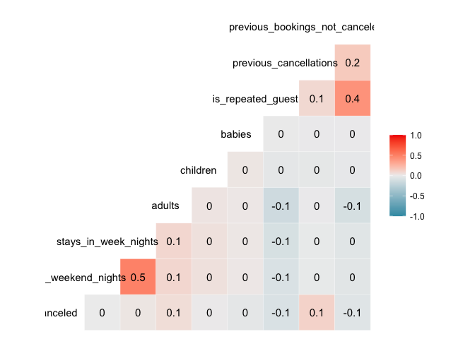

From the correlation result we’ve got, there are no obvious correlation
(mostly less than 0.1) between these variables. The 0.5 correaltion
between stay\_in\_week\_nights and stays\_in\_weekend\_nights may
indicates that people may incline to book hotel from week days to
weekends.<br/><br/>

#### Question 2: Which are the busiest months for hotels?

``` r
### year 2015
booking_by_month <- hotel_bookings %>%
  subset(arrival_date_year == 2015) %>%
  group_by(arrival_date_month) %>%
  summarize(n = n())
# design labs for the plot
month_labels = c('Jul' ,'Aug', 'Sep', 'Oct', 'Nov' , 'Dec')
booking_by_month$month_name <- month_labels
booking_by_month$month_name <- factor(booking_by_month$month_name,
                                      levels = unique(booking_by_month$month_name))
p1 <- ggplot(booking_by_month, aes(x = month_name, y = n)) + 
  geom_bar(stat = 'identity', fill="navyblue", color = 'orange', width = 1, lwd = 0.8) +
  labs(x = 'Arrival Month', y = "Total Customers",
       title = 'Book Amount by Month of Year 2015') +
  geom_point(shape=21, fill="red", color = 'black') +
  geom_line(group = 1, size = 1, color = 'orange') +
  theme_bw() + 
  theme(plot.title = element_text(hjust=0.5))

### year 2016
booking_by_month <- hotel_bookings %>%
  subset(arrival_date_year == 2016) %>%
  group_by(arrival_date_month) %>%
  summarize(n = n())
# design labs for the plot
month_labels = c('Jan', 'Feb', 'Mar', 'Apr', 'May', 'Jun', 'Jul' ,'Aug', 'Sep', 
                 'Oct', 'Nov' , 'Dec')
booking_by_month$month_name <- month_labels
booking_by_month$month_name <- factor(booking_by_month$month_name,
                                      levels = unique(booking_by_month$month_name))
p2 <- ggplot(booking_by_month, aes(x = month_name, y = n)) + 
  geom_bar(stat = 'identity', fill="navyblue", color = 'orange', width = 1, lwd = 0.8) +
  labs(x = 'Arrival Month', y = "Total Customers",
       title = 'Book Amount by Month of Year 2016') +
  geom_point(shape=21, fill="red", color = 'black') +
  geom_line(group = 1, size = 1, color = 'orange') +
  theme_bw() + 
  theme(plot.title = element_text(hjust=0.5))

### 2017
booking_by_month <- hotel_bookings %>%
  subset(arrival_date_year == 2017) %>%
  group_by(arrival_date_month) %>%
  summarize(n = n())
# design labs for the plot
month_labels = c('Jan', 'Feb', 'Mar', 'Apr', 'May', 'Jun', 'Jul' ,'Aug')
booking_by_month$month_name <- month_labels
booking_by_month$month_name <- factor(booking_by_month$month_name,
                                      levels = unique(booking_by_month$month_name))
p3 <- ggplot(booking_by_month, aes(x = month_name, y = n)) + 
  geom_bar(stat = 'identity', fill="navyblue", color = 'orange', width = 1, lwd = 0.8) +
  labs(x = 'Arrival Month', y = "Total Customers",
       title = 'Book Amount by Month of Year 2017') +
  geom_point(shape=21, fill="red", color = 'black') +
  geom_line(group = 1, size = 1, color = 'orange') +
  theme_bw() + 
  theme(plot.title = element_text(hjust=0.5))
# combine the three plots
grid.arrange(p1, p2, p3, ncol = 1)
```

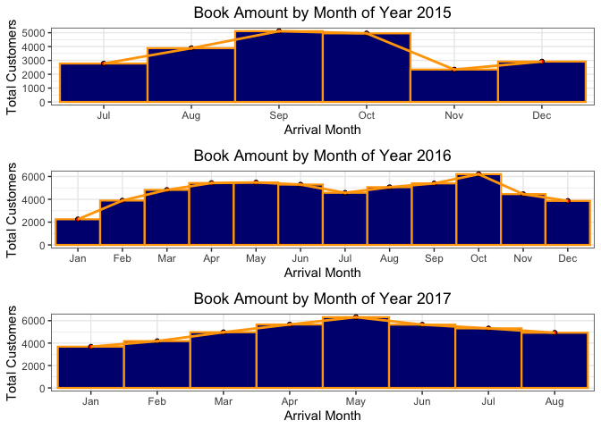
We can conclude that the busiest months are from March to June, and from
September to October.<br /> <br />

#### Qestion 3: Does cancel rate has similar distribution as booking amount does?

``` r
cancel_by_month <- hotel_bookings %>%
                   subset(arrival_date_year == 2015) %>%
          # group the dataframe by arrive_date and calculate the cancle rate of each day 
                   group_by(arrival_date_month) %>%
                   summarize(n = n()) %>%
          # add field with cancel rate        
                   mutate(cancel_percent = n / nrow(hotel_bookings) * 100)

month_labels = c('Jul' ,'Aug', 'Sep', 
                 'Oct', 'Nov' , 'Dec')
cancel_by_month$month_name <- month_labels
cancel_by_month$month_name <- factor(cancel_by_month$month_name,
                                    levels = unique(cancel_by_month$month_name))
# visualize by bar plot
p1 <- ggplot(cancel_by_month, aes(x = month_name, y = cancel_percent)) +
        geom_bar(stat = 'identity', fill="orange", color = 'navyblue', 
                 width = 1, lwd = 0.8) +
        geom_point(shape=21, fill="hotpink1", color = 'black') +
        geom_line(group = 1, size = 1, color = 'steelblue4') +
        theme_bw() +
        labs(x = 'Date', y = '% of Cancel', title = 'Cancel Rate by Month of Year 2015') +
        theme(plot.title = element_text(hjust=0.5))

cancel_by_month <- hotel_bookings %>%
                   subset(arrival_date_year == 2016) %>%
          # group the dataframe by arrive_date and calculate the cancle rate of each day 
                   group_by(arrival_date_month) %>%
                   summarize(n = n()) %>%
          # add field with cancel rate        
                   mutate(cancel_percent = n / nrow(hotel_bookings) * 100)

month_labels = c('Jan', 'Feb', 'Mar', 'Apr', 'May', 'Jun', 'Jul' ,'Aug', 'Sep', 
                 'Oct', 'Nov' , 'Dec')
cancel_by_month$month_name <- month_labels
cancel_by_month$month_name <- factor(cancel_by_month$month_name,
                                    levels = unique(cancel_by_month$month_name))
# visualize by bar plot
p2 <- ggplot(cancel_by_month, aes(x = month_name, y = cancel_percent)) +
        geom_bar(stat = 'identity', fill="orange", color = 'navyblue', 
                 width = 1, lwd = 0.8) +
        geom_point(shape=21, fill="hotpink1", color = 'black') +
        geom_line(group = 1, size = 1, color = 'steelblue4') +
        theme_bw() +
        labs(x = 'Date', y = '% of Cancel', title = 'Cancel Rate by Month of Year 2016') +
        theme(plot.title = element_text(hjust=0.5))

cancel_by_month <- hotel_bookings %>%
                   subset(arrival_date_year == 2017) %>%
          # group the dataframe by arrive_date and calculate the cancle rate of each day 
                   group_by(arrival_date_month) %>%
                   summarize(n = n()) %>%
          # add field with cancel rate        
                   mutate(cancel_percent = n / nrow(hotel_bookings) * 100)

month_labels = c('Jan', 'Feb', 'Mar', 'Apr', 'May', 'Jun', 'Jul' ,'Aug')
cancel_by_month$month_name <- month_labels
cancel_by_month$month_name <- factor(cancel_by_month$month_name,
                                    levels = unique(cancel_by_month$month_name))
# visualize by bar plot
p3 <- ggplot(cancel_by_month, aes(x = month_name, y = cancel_percent)) +
        geom_bar(stat = 'identity', fill="orange", color = 'navyblue', 
                 width = 1, lwd = 0.8) +
        geom_point(shape=21, fill="hotpink1", color = 'black') +
        geom_line(group = 1, size = 1, color = 'steelblue4') +
        theme_bw() +
        labs(x = 'Date', y = '% of Cancel', title = 'Cancel Rate by Month of Year 2017') +
        theme(plot.title = element_text(hjust=0.5))

grid.arrange(p1, p2, p3, ncol = 1)
```

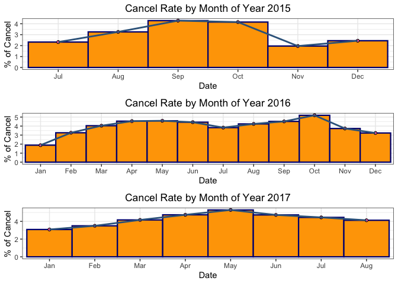

Compare the cancel rate graph with the booking amount graph, we can see
that the plot trend are pretty much the same, and so we coonclude that
book amount and cancel rate have positive relationship.<br /> <br />

#### Question 4: What is the distribution of number of customers by day?

``` r
# plot for year 2015
p1 <- hotel_bookings %>% 
        subset(arrival_date_year == 2015) %>%
        group_by(arrival_date, hotel) %>%
        summarize(n = n()) %>%
        ggplot(aes(x = arrival_date, y = n)) +
        geom_point(aes(color = hotel)) +
        scale_color_manual(name='Hotel Type', values =c('navyblue','orange')) +
        labs(x = 'Arrival Date', y = 'Total Customers', title = 'Arrival Date vs. Booking Amount of Year 2015') +
        scale_x_date(date_breaks = "1 month", date_labels = "%m-%d") +
        theme_bw() +
        theme(plot.title = element_text(hjust = 0.5))

# plot for year 2016
p2 <- hotel_bookings %>% 
        subset(arrival_date_year == 2016) %>%
        group_by(arrival_date, hotel) %>%
        summarize(n = n()) %>%
        ggplot(aes(x = arrival_date, y = n)) +
        geom_point(aes(color = hotel)) +
        scale_color_manual(name='Hotel Type', values =c('navyblue','orange')) +
        labs(x = 'Arrival Date', y = 'Total Customers', title = 'Arrival Date vs. Booking Amount of Year 2016') +
        scale_x_date(date_breaks = "1 month", date_labels = "%m-%d") +
        theme_bw() +
        theme(plot.title = element_text(hjust = 0.5))

# plot for year 2017
p3 <- hotel_bookings %>% 
        subset(arrival_date_year == 2017) %>%
        group_by(arrival_date, hotel) %>%
        summarize(n = n()) %>%
        ggplot(aes(x = arrival_date, y = n)) +
        geom_point(aes(color = hotel)) +
        scale_color_manual(name='Hotel Type', values =c('navyblue','orange')) +
        labs(x = 'Arrival Date', y = 'Total Customers', title = 'Arrival Date vs. Booking Amount of Year 2017') +
        scale_x_date(date_breaks = "1 month", date_labels = "%m-%d") +
        theme_bw() +
        theme(plot.title = element_text(hjust = 0.5))

# combine three plots
grid.arrange(p1, p2, p3, ncol = 1)
```

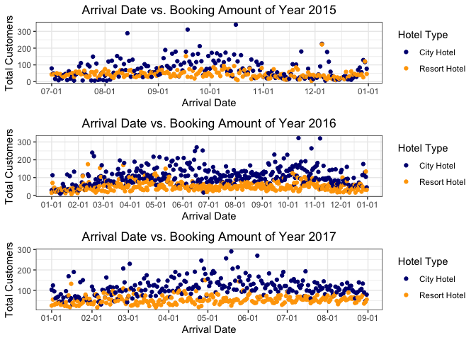

From the graph, we can see that:  
1\. City hotel is more popular than resort hotel.  
2\. Hotel attract more customers with year goes by.  
3\. There are several days for which the total customers is close to
300, which may due to holodays.<br/><br/>

#### Question 5: Will holiday boost the number of customers?

``` r
# year 2015
p1 <- hotel_bookings %>% 
  subset(arrival_date_year == 2015) %>%
  group_by(arrival_date, hotel) %>%
  summarize(n = n()) %>%
  ggplot(aes(x = arrival_date, y = n)) + 
  geom_point(aes(color = hotel)) + 
  scale_color_manual(name='Hotel Type', values =c('navyblue','orange')) +
  labs(x = 'Arrival Date', y = 'Booking Amount', title = 'Arraval Date vs. Booking Amount of Year 2015') +
  scale_x_date(date_breaks = "1 month", date_labels = "%m-%d") +
  theme_bw() +
  theme(plot.title = element_text(hjust = 0.5)) +
  geom_vline(aes(xintercept=(as.numeric(as.Date("2015-12-25")))), 
             linetype = 2, color = 'brown', lwd = 0.8) + 
  geom_text(aes(x=(as.Date("2015-12-25")), y= 100, label='Christmas'),
            size=4.5, angle=90, vjust=-0.4, hjust=0) +
  geom_vline(aes(xintercept=(as.numeric(as.Date("2015-07-03")))), 
             linetype = 2, color = 'brown', lwd = 0.8) +
  geom_text(aes(x=(as.Date("2015-07-03")), y= 100, label='Independence Day'),
            size=4.5, angle=90, vjust=-0.4, hjust=0) +
  geom_vline(aes(xintercept=(as.numeric(as.Date("2015-11-26")))), 
             linetype = 2, color = 'brown', lwd = 0.8) + 
  geom_text(aes(x=(as.Date("2015-11-26")), y= 100, label='Thanksgiving'),
            size=4.5, angle=90, vjust=-0.4, hjust=0) +
  geom_vline(aes(xintercept=(as.numeric(as.Date("2015-10-31")))), 
             linetype = 2, color = 'brown', lwd = 0.8) + 
  geom_text(aes(x=(as.Date("2015-10-31")), y= 100, label='Halloween'),
            size=4.5, angle=90, vjust=-0.4, hjust=0)
  
# year2016
p2 <- hotel_bookings %>% 
  subset(arrival_date_year == 2016) %>%
  group_by(arrival_date, hotel) %>%
  summarize(n = n()) %>%
  ggplot(aes(x = arrival_date, y = n)) +
  geom_point(aes(color = hotel)) +
  scale_color_manual(name='Hotel Type', values =c('navyblue','orange')) +
  labs(x = 'Arrival Date', y = 'Booking Amount', title = 'Arraval Date vs. Booking Amount of Year 2016') +
  scale_x_date(date_breaks = "1 month", date_labels = "%m-%d") +
  theme_bw() +
  theme(plot.title = element_text(hjust = 0.5)) + 
  geom_vline(aes(xintercept=(as.numeric(as.Date("2016-12-25")))), 
             linetype = 2, color = 'brown', lwd = 0.8) + 
  geom_text(aes(x=(as.Date("2016-12-25")), y= 100, label='Christmas'),
            angle=90, vjust=-0.4, hjust=0) +
  geom_vline(aes(xintercept=(as.numeric(as.Date("2016-01-01")))),
             linetype = 2, color = 'brown', lwd = 0.8) +
  geom_text(aes(x = as.Date("2016-01-01"), y = 100, label = 'New Year\'s Day',
            angle = 90, vjust=-0.4, hjust=0)) +
  geom_vline(aes(xintercept=(as.numeric(as.Date("2016-01-20")))),
             linetype = 2, color = 'brown', lwd = 0.8) +
  geom_text(aes(x = as.Date("2016-01-20"), y = 100, label = 'Martin Luther King Day',
            angle = 90, vjust=-0.4, hjust=0)) +
  geom_vline(aes(xintercept=(as.numeric(as.Date("2016-02-14")))),
             linetype = 2, color = 'brown', lwd = 0.8) +
  geom_text(aes(x = as.Date("2016-02-14"), y = 100, label = 'Valentine\'s Day',
            angle = 90, vjust=-0.4, hjust=0)) +
  geom_vline(aes(xintercept=(as.numeric(as.Date("2016-03-17")))),
             linetype = 2, color = 'brown', lwd = 0.8) +
  geom_text(aes(x = as.Date("2016-03-17"), y = 100, label = 'St.Patrick\'s Day',
            angle = 90, vjust=-0.4, hjust=0)) +
  geom_vline(aes(xintercept=(as.numeric(as.Date("2016-05-01")))), 
             linetype = 2, color = 'brown', lwd = 0.8) + 
  geom_text(aes(x=(as.Date("2016-05-01")), y= 100, label='May Day'),
            angle=90, vjust=-0.4, hjust=0) +
  geom_vline(aes(xintercept=(as.numeric(as.Date("2016-07-03")))), 
             linetype = 2, color = 'brown', lwd = 0.8) + 
  geom_text(aes(x=(as.Date("2016-07-03")), y= 100, label='Independence Day'),
            angle=90, vjust=-0.4, hjust=0) +
  geom_vline(aes(xintercept=(as.numeric(as.Date("2016-11-26")))), 
             linetype = 2, color = 'brown', lwd = 0.8) + 
  geom_text(aes(x=(as.Date("2016-11-26")), y= 100, label='Thanksgiving'),
            angle=90, vjust=-0.4, hjust=0) +
  geom_vline(aes(xintercept=(as.numeric(as.Date("2016-10-31")))), 
             linetype = 2, color = 'brown', lwd = 0.8) + 
  geom_text(aes(x=(as.Date("2016-10-31")), y= 100, label='Halloween'),
            angle=90, vjust=-0.4, hjust=0)

# year 2017
p3 <- hotel_bookings %>% 
  subset(arrival_date_year == 2017) %>%
  group_by(arrival_date, hotel) %>%
  summarize(n = n()) %>%
  ggplot(aes(x = arrival_date, y = n)) +
  geom_point(aes(color = hotel)) +
  scale_color_manual(name='Hotel Type', values =c('navyblue','orange')) +
  labs(x = 'Arrival Date', y = 'Booking Amount', title = 'Arraval Date vs. Number of Customers of Year 2017') +
  scale_x_date(date_breaks = "1 month", date_labels = "%m-%d") +
  theme_bw() +
  theme(plot.title = element_text(hjust = 0.5)) + 
  geom_vline(aes(xintercept=(as.numeric(as.Date("2017-01-01")))),
             linetype = 2, color = 'brown', lwd = 0.8) +
  geom_text(aes(x = as.Date("2017-01-01"), y = 100, label = 'New Year\'s Day',
                size=4.5,angle = 90, vjust=-0.4, hjust=0)) + 
  geom_vline(aes(xintercept=(as.numeric(as.Date("2017-01-20")))),
             linetype = 2, color = 'brown', lwd = 0.8) +
  geom_text(aes(x = as.Date("2017-01-20"), y = 100, label = 'Martin Luther King Day',
                size=4.5,angle = 90, vjust=-0.4, hjust=0)) +
  geom_vline(aes(xintercept=(as.numeric(as.Date("2017-02-14")))),
             linetype = 2, color = 'brown', lwd = 0.8) +
  geom_text(aes(x = as.Date("2017-02-14"), y = 100, label = 'Valentine\'s Day',
                size=4.5,angle = 90, vjust=-0.4, hjust=0)) +
  geom_vline(aes(xintercept=(as.numeric(as.Date("2017-03-17")))),
             linetype = 2, color = 'brown', lwd = 0.8) +
  geom_text(aes(x = as.Date("2017-03-17"), y = 100, label = 'St.Patrick\'s Day',
                size=4.5,angle = 90, vjust=-0.4, hjust=0)) +
  geom_vline(aes(xintercept=(as.numeric(as.Date("2017-05-01")))), 
             linetype = 2, color = 'brown', lwd = 0.8) + 
  geom_text(aes(x=(as.Date("2017-05-01")), y= 100, label='May Day'),
                size=4.5,angle=90, vjust=-0.4, hjust=0) +
  geom_vline(aes(xintercept=(as.numeric(as.Date("2017-07-03")))), 
             linetype = 2, color = 'brown', lwd = 0.8) + 
  geom_text(aes(x=(as.Date("2017-07-03")), y= 100, label='Independence Day'),
                size=4.5,angle=90, vjust=-0.4, hjust=0)

p1
```

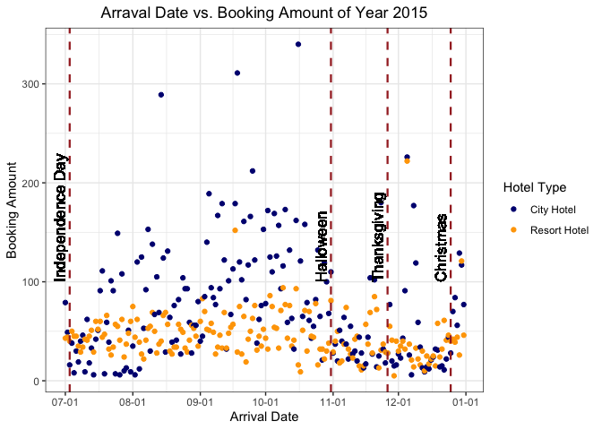

``` r
p2
```

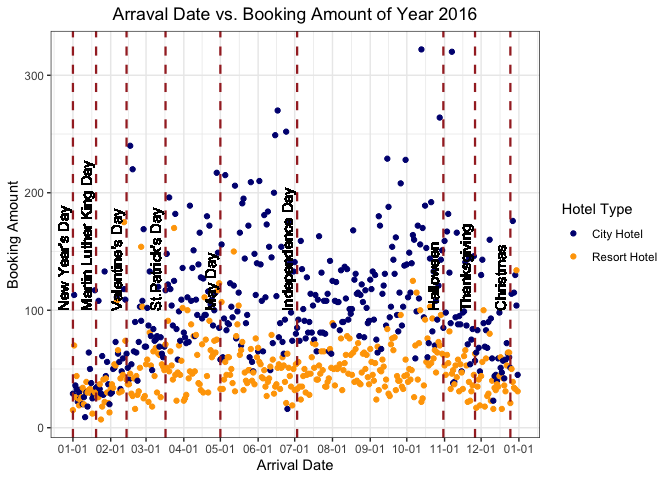

``` r
p3
```

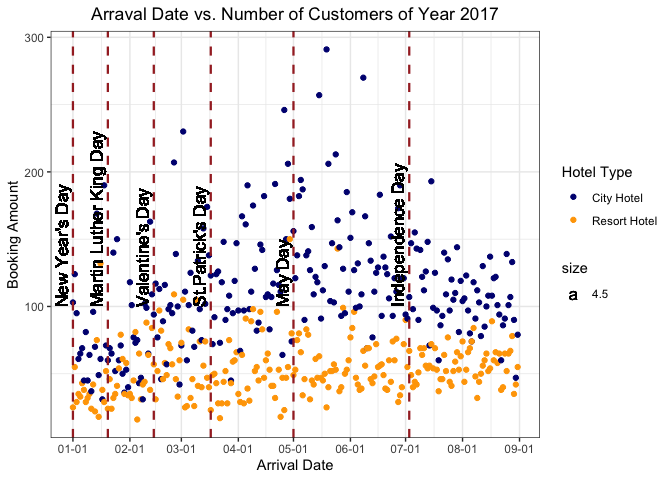

In year 2015, there is no obvious correlation between holidays and the
number of customers, while in year 2016 and year 2017, holidays appear
to line up with high number of customers.<br/><br/>

#### Qestion 6: Does longer lead time lead to higher cancel rate?

``` r
# filter all the outliers of lead time
f <- fivenum(hotel_bookings$lead_time)
outlier <- c(f[2] - 1.5*(f[4] - f[2]), f[4] + 1.5*(f[4] - f[2]))
rows <- which(hotel_bookings$lead_time >= outlier[1] & hotel_bookings$lead_time <= outlier[2])
lead_time_vs_cancel <- hotel_bookings[rows, c("lead_time", "is_canceled")]
lead_time_vs_cancel <- lead_time_vs_cancel %>%
                       group_by(lead_time) %>%
                       summarize(cancel_rate = mean(is_canceled),
                                 n = n())

ggplot(lead_time_vs_cancel, aes(x = lead_time, y = cancel_rate)) + 
  geom_point(color = 'navyblue') +
  geom_smooth(method = 'lm', color = 'orange', se = FALSE)+
  labs(x = "Lead Time", y = "Cancle Rate", title = "Lead Time vs. Cancel Rate") +
  theme_bw() +
  theme(plot.title = element_text(hjust=0.5))
```

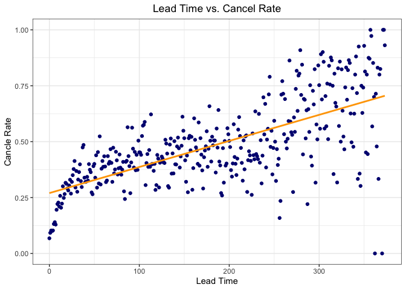

``` r
# cut the data into bind of 20days
range(lead_time_vs_cancel$lead_time)
```

    ## [1]   0 373

``` r
lead_time_vs_cancel$bucket <- cut(lead_time_vs_cancel$lead_time,
                                  breaks = c(0, 5, 10, 30, 50, 100, 200, 300, 400), inclued.lowest = TRUE, right = FALSE)
# create a new dataframe grouping by lead time bucket
lead_time_vs_cancel_bucket <- lead_time_vs_cancel %>%
                              group_by(bucket) %>%
                              summarize(cancel_rate = mean(cancel_rate),
                                        n = n())
lead_time_vs_cancel_bucket$relative_cancel_rate <- 
  with(lead_time_vs_cancel_bucket, 100 * (cancel_rate - mean(cancel_rate)) / mean(cancel_rate))
# visualization
ggplot(lead_time_vs_cancel_bucket, aes(x = bucket, y = relative_cancel_rate)) +
  geom_bar(stat = 'identity', color = "darkorange3", fill = "royalblue4", width = 1, lwd = 0.8) +
  labs(x = "Lead Time Group (days)", y = "Relative Cancel Rate %",
       title = "Cancel Rate vs Lead Time Group") +
  theme_bw() +
  theme(plot.title = element_text(hjust=0.5))
```

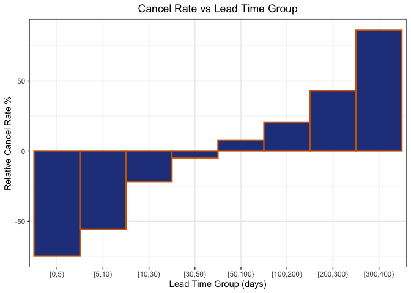

``` r
cor.test(lead_time_vs_cancel$lead_time, lead_time_vs_cancel$cancel_rate)
```

    ## 
    ##  Pearson's product-moment correlation
    ## 
    ## data:  lead_time_vs_cancel$lead_time and lead_time_vs_cancel$cancel_rate
    ## t = 17.311, df = 371, p-value < 2.2e-16
    ## alternative hypothesis: true correlation is not equal to 0
    ## 95 percent confidence interval:
    ##  0.6081917 0.7210525
    ## sample estimates:
    ##       cor 
    ## 0.6684524

From the charts, the longer the lead time is, the higher cancel rate
appears. Also, when lead time is larger than 50 days, cancel rate will
be above average cancel rate. Hotels may need to .add extra number of
available booking rooms to offset the reduced profit due to canceled
bookings. <br/><br/>

#### Qestion 7 : How long do customers usually stay in the hotel?

``` r
total_nights <- hotel_bookings$stays_in_weekend_nights + hotel_bookings$stays_in_week_nights
total_nights <- as.data.frame(table(total_nights))
total_nights <- arrange(total_nights, desc(Freq))
ggplot(total_nights[1:10, ], aes(x = total_nights, y = Freq,
                                 fill = ifelse(total_nights == 2, "Highlight", "Normal"))) + 
  geom_bar(stat = 'identity', color = "white", width = 1, lwd = 0.8, show.legend = FALSE) +
   scale_fill_manual(values =c('orange', 'navyblue')) +
  labs(x = "Total Nights", y = "Frequency", title = 'Frequency of Total Stay Night (Top 10)') +
  theme_bw() +
  theme(plot.title = element_text(hjust = 0.5))
```

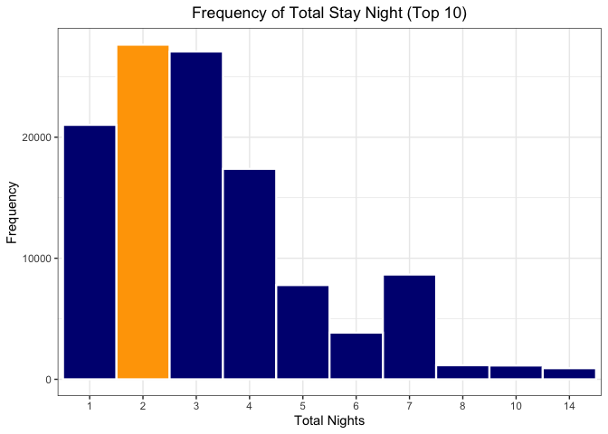

Based on the chart, most customers stay in the hotel for 1 to 3 days,
and 2 day is the most popular one.<br/><br/>

#### Question 8: Examine the distribution of the lead time

``` r
ggplot(hotel_bookings, aes(x = lead_time)) + 
  geom_histogram(color = "orange", fill = "navyblue") +
  theme_bw() +
  labs(x = "Lead Time (days)", y = "Frequency", title = "Lead Time Frequency") +
  theme(plot.title = element_text(hjust = 0.5))
```

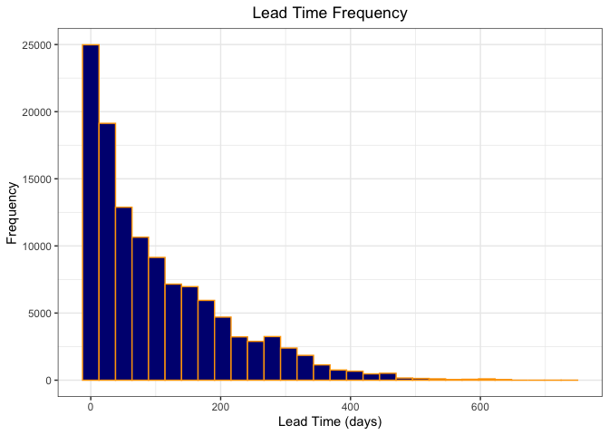

From the graph, we can examine that lead\_time varibale follows
exponential distribution. <br/><br/>

#### Question 9: Does lead time follow Central Limit Theorem?

``` r
samples = 10000
sample.size1 = 10
xbar1 <- numeric(samples)
for(i in 1:samples){
  xbar1[i] <- mean(sample(hotel_bookings$lead_time, size = sample.size1, replace = TRUE))
}
xbar1 <- data.frame(xbar1)
p1 <- ggplot(xbar1, aes(x = xbar1)) + 
  geom_histogram(color = "orange", fill = "navyblue", lwd = 1, binwidth = 3) +
  theme_bw() +
  labs(x = "Lead Time Sample", y = "Frequency", title = "Sample Size = 10") +
  theme(plot.title = element_text(hjust = 0.5)) +
  xlim(0, 200)

sample.size2 = 50
xbar2 <- numeric(samples)
for(i in 1:samples){
  xbar2[i] <- mean(sample(hotel_bookings$lead_time, size = sample.size2, replace = TRUE))
}
xbar2 <- data.frame(xbar2)
p2 <- ggplot(xbar2, aes(x = xbar2)) + 
  geom_histogram(color = "orange", fill = "navyblue", lwd = 0.8, binwidth = 3) +
  theme_bw() +
  labs(x = "Lead Time Sample", y = "Frequency", title = "Sample Size = 50") +
  theme(plot.title = element_text(hjust = 0.5)) + 
  xlim(0, 200)

sample.size3 = 100
xbar3 <- numeric(samples)
for(i in 1:samples){
  xbar3[i] <- mean(sample(hotel_bookings$lead_time, size = sample.size3, replace = TRUE))
}
xbar3 <- data.frame(xbar3)
p3 <- ggplot(xbar3, aes(x = xbar3)) + 
  geom_histogram(color = "orange", fill = "navyblue", lwd = 1, binwidth = 3) +
  theme_bw() +
  labs(x = "Lead Time Sample", y = "Frequency", title = "Sample Size = 100") +
  theme(plot.title = element_text(hjust = 0.5)) +
  xlim(0, 200)

sample.size4 = 500
xbar4 <- numeric(samples)
for(i in 1:samples){
  xbar4[i] <- mean(sample(hotel_bookings$lead_time, size = sample.size4, replace = TRUE))
}
xbar4 <- data.frame(xbar4)
p4 <- ggplot(xbar4, aes(x = xbar4)) + 
  geom_histogram(color = "orange", fill = "navyblue", lwd = 1, binwidth = 2) +
  theme_bw() +
  labs(x = "Lead Time Sample", y = "Frequency", title = "Sample Size = 500") +
  theme(plot.title = element_text(hjust = 0.5)) +
  xlim(0, 200)

grid.arrange(p1, p2, p3, p4)
```

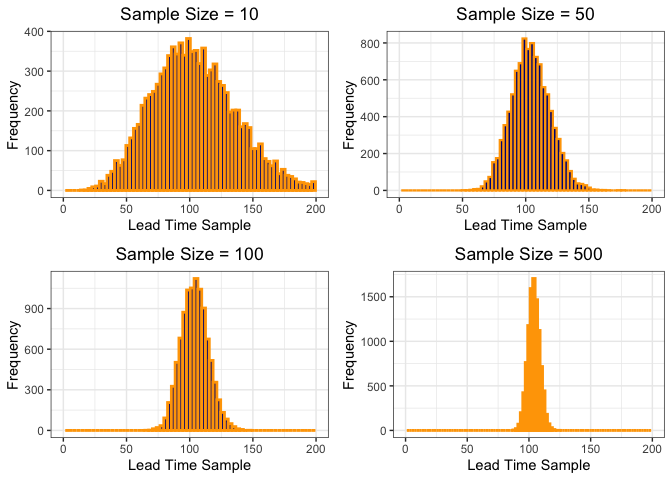

``` r
# mean and standrad deviation values for each sample
sample.sizes <- c(10, 50, 100, 500)
means <- round(c(mean(xbar1$xbar1), mean(xbar2$xbar2), mean(xbar3$xbar3), mean(xbar4$xbar4)))
sds <- round(c(sd(xbar1$xbar1), sd(xbar2$xbar2), sd(xbar3$xbar3), sd(xbar4$xbar4)), 2)
for (i in 1:4){
  x <- sprintf("Sample Size = %g  Mean = %g  SD = %g", sample.sizes[i], means[i], sds[i])
  print(x)
}
```

    ## [1] "Sample Size = 10  Mean = 104  SD = 33.59"
    ## [1] "Sample Size = 50  Mean = 104  SD = 15.27"
    ## [1] "Sample Size = 100  Mean = 104  SD = 10.67"
    ## [1] "Sample Size = 500  Mean = 104  SD = 4.77"

By drawing samples from lead\_time variable, we can see that the
distribution of the sample means has the shape of a normal distribution
for a large sample. The mean of the sample mean distribution is equal to
the mean of the original lead\_time data. The higher the sample, the
smaller the standard deviation, the narrower the spread of the sample
means.<br/><br/>

#### Question 10: Apply various sampling methods on lead\_time data

``` r
# simple random sampling
s <- srswr(1000, nrow(hotel_bookings))
rows <- (1:nrow(hotel_bookings))[s!=0]
rows <- rep(rows, s[s != 0])
sample1 <- hotel_bookings[rows, ]
sample1 <- data.frame(sample1$lead_time)
p1 <- ggplot(sample1, aes(x = sample1.lead_time)) +
        geom_histogram(color = "orange", fill = "navyblue", lwd = 0.8) +
        theme_bw() +
        labs(x = "Lead Time", y = "Frequency", title = "SRS (With Replacement)") +
        theme(plot.title = element_text(hjust = 0.5))

# simple random sampling without replacement
s <- srswor(1000, nrow(hotel_bookings))
sample2 <- hotel_bookings[s!=0, ]
sample2 <- data.frame(sample2$lead_time)
    p2 <- ggplot(sample2, aes(x = sample2.lead_time)) +
      geom_histogram(color = "orange", fill = "navyblue", lwd = 0.8) +
      theme_bw() +
      labs(x = "Lead Time", y = "Frequency", title = "SRS (Without Replacement)") +
      theme(plot.title = element_text(hjust = 0.5))

# Systemematic Sampling
N <- nrow(hotel_bookings)
n <- 1000
k <- ceiling(N/n)
r <- sample(k, 1)
s <- seq(r, by= k, length = n)
sample3 <- hotel_bookings[s, ]
sample3 <- data.frame(sample3$lead_time)
p3 <- ggplot(sample3, aes(x = sample3.lead_time)) + 
        geom_histogram(color = "orange", fill = "navyblue", lwd = 0.8) +
        theme_bw() +
        labs(x = "Lead Time", y = "Frequency", title = "Systematic Sampling") +
        theme(plot.title = element_text(hjust = 0.5))

# Unequal Probabilities
pik <- inclusionprobabilities(hotel_bookings$lead_time, 1000)
s <- UPsystematic(pik)
sample4 <- hotel_bookings[s != 0, ]
sample4 <- data.frame(sample4$lead_time)
p4 <- ggplot(sample4, aes(x = sample4.lead_time)) + 
        geom_histogram(color = "orange", fill = "navyblue", lwd = 0.8) +
        theme_bw() +
        labs(x = "Lead Time", y = "Frequency", title = "Unequal Probabilities") +
        theme(plot.title = element_text(hjust = 0.5))

# Stratified Sampling
freq <- table(hotel_bookings$hotel)
sizes <- 1000 * freq / sum(freq)
sample5 <- strata(hotel_bookings, stratanames = c("hotel"), size = sizes, method = "srswor",
                  description = FALSE)
sample5 <- getdata(hotel_bookings, sample5)
p5 <- ggplot(sample5, aes(x = lead_time)) + 
          geom_histogram(aes(fill = hotel)) +
          scale_fill_manual(name='Hotel Type', values =c('navyblue','orange')) +
          facet_wrap(~hotel) + 
          labs(x = "Lead Time", y = "Frequncy", title = "Stratified Sampling") +
            theme_bw() +
            theme(plot.title = element_text(hjust = 0.5))

p6 <- ggplot(hotel_bookings, aes(x = lead_time)) + 
        geom_histogram(aes(fill = hotel)) +
        scale_fill_manual(name='Hotel Type', values =c('navyblue','orange')) +
        facet_wrap(~hotel) + 
        labs(x = "Lead Time", y = "Frequncy", title = "Original Data") +
        theme_bw() +
        theme(plot.title = element_text(hjust = 0.5))
grid.arrange(p1, p2, p3, p4)
```

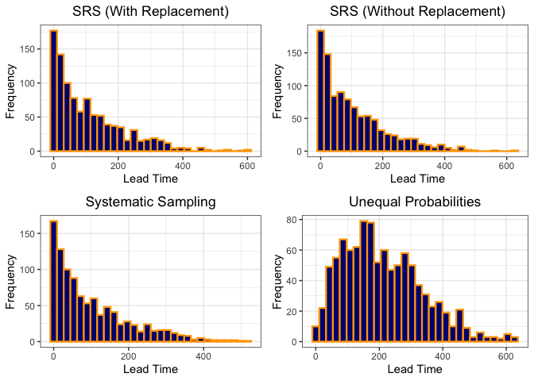

``` r
grid.arrange(p5, p6)
```

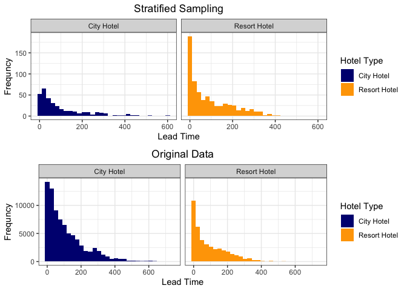

From the graph, we can see that samples from simple random sampling,
systematic sampling and stratified sampling can represent the parent
data due to similar shape and can be used for analysis. However, the
data extracted by unequal probability method cannot represent the
population and cannot be used for analysis.<br/><br/>

### PART4 Conclusion

1.  Most customers who book hotels are adults, hotels may focus on
    designing rooms and promotions according to adults’ preferences.  
2.  The demand for parking space is very small, hotels may utilize some
    unused space to increase profits.  
3.  The busiest period are late spring and early autumn.  
4.  With booking amount increases, the cancel rate increases. With lead
    time increases, the cancel rate increases. Hotels may provide extra
    amount of rooms available for booking.  
5.  City hotel has more customers compare to resort hotel does.  
6.  Hotel may increase the price slightly in holodays and special days.
